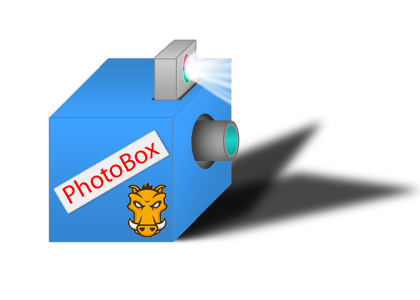

# grunt-photoBox



> Plugin to prevent your project of broken layout via screenshot photo sessions of your site.

## Getting Started
This plugin requires Grunt `~0.4.1`

If you haven't used [Grunt](http://gruntjs.com/) before, be sure to check out the [Getting Started](http://gruntjs.com/getting-started) guide, as it explains how to create a [Gruntfile](http://gruntjs.com/sample-gruntfile) as well as install and use Grunt plugins. Once you're familiar with that process, you may install this plugin with this command:

```shell
npm install grunt-photoBox --save-dev
```

Once the plugin has been installed, it may be enabled inside your Gruntfile with this line of JavaScript:

```js
grunt.loadNpmTasks('grunt-photoBox');
```

## The "photoBox" task

### Overview
In your project's Gruntfile, add a section named `photoBox` to the data object passed into `grunt.initConfig()`.

```js
grunt.initConfig({
  photoBox: {
    options: {
      // Task-specific options go here.
    }
  },
})
```

PhotoBox helps you to not deploy any broken layout to production. It takes screenshots of you current site. 

**Additionally you got the feature, to keep the last photosession and to overlay old and new screenshots, to see even better if something is broken or not. BE ALWAYS SURE, THAT YOU HAVEN'T BROKEN LAYOUT THE EASY WAY.**


### Options

#### options.indexPath
Type: `String`
Default value: `photoBox/`

A string value that is used to set the path to the generated images and **index.html**.

Per default the ```photoBox``` will be generated and inside of that folder is the index.html to check for broken layout.

#### options.screenSizes
Type: `Array`
Default value: `[ '800x600' ]`

An array containing strings, that represent the wished dimensions of the pictures.

E.g. **'800x600'** -> width: 800px; height: 600px;

#### options.urls
Type: `Array`
Default value: `[ 'http://4waisenkinder.de' ]`

An array containing strings, that represent the wished urls for the photosession.

### Usage Examples

#### Default Options
In this example, the default options are used to do just show what is possible. Run ```grunt photoBox``` without any custom options and you will get a new file at ```photoBox/index.html```. 

It will consist of on screenshot for the default url ( http://4waisenkinder.de ) and the default size ( 800x600 ).

```js
grunt.initConfig({
  photoBox: {
    options: {}
  }
})
```

#### Custom Options
Now let's customize everything for your needs. 

```js
grunt.initConfig({
  photoBox: {
    options: {
      sizes: [ '600x900', '1000x900', '1200x900' ],
      urls:  [ 'http://yoursite.com', 'http://yoursite.com/blog', 'http://yoursite.com/catalog' ]
    }
  }
})
```

This will generate you 9 screenshots - each url in each size.

## Contributing
In lieu of a formal styleguide, take care to maintain the existing coding style. Add unit tests for any new or changed functionality. Lint and test your code using [Grunt](http://gruntjs.com/).

## Release History
0.1.0 - Initial release.
